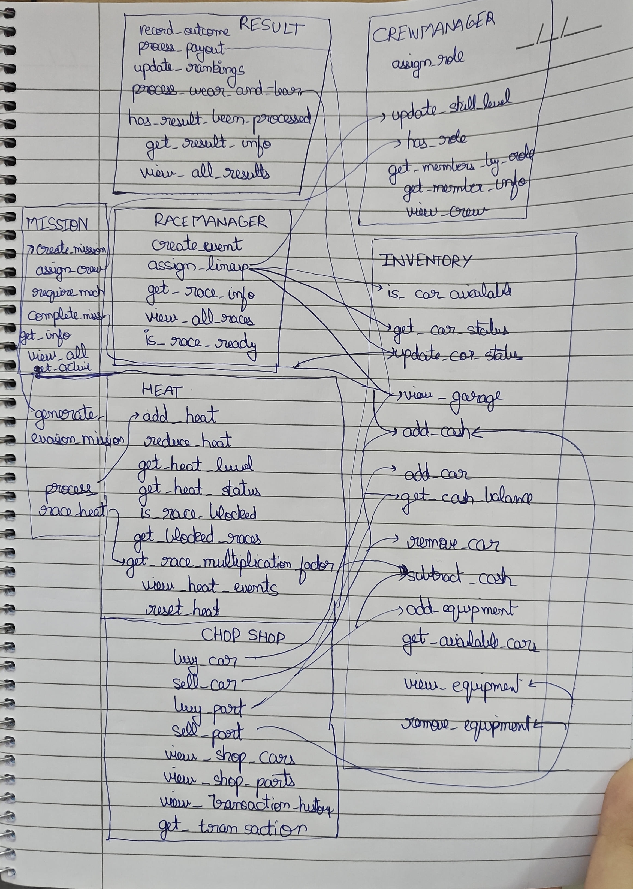

# Integration Testing Report

## Call graph

## 1. Fundamental Race Setup Integration (`TestCase1_Valid`)
- **Modules Involved:** `Registration`, `CrewManager`, `Inventory`, `RaceManager`
- **Scenario:** Registering a driver, assigning a role, adding a car, creating an event, and assigning them to a race lineup. Also trying to assign a lineup where the car doesn't exist.
- **Expected Result:** Valid setups succeed and become "Ready", missing vehicles raise an error.
- **Actual Result:** Passed.
- **Errors/Issues Found:** None.
- **Why it's needed:** Proves that the fundamental path of getting a racer into a race works correctly from start to finish, and missing core items enforce rules.

## 2. Missing Prerequisites (`TestCase2_MissingPrerequisite`)
- **Modules Involved:** `Registration`, `CrewManager`, `Inventory`, `RaceManager`
- **Scenario:** Trying to put an unregistered driver into a race, assigning a registered crew member who doesn't have the "Driver" role to drive, and querying available drivers when multiple people have mixed roles.
- **Expected Result:** System throws errors refusing entry for non-existent or wrong-role drivers, and correctly filters drivers by role.
- **Actual Result:** Passed.
- **Errors/Issues Found:** None.
- **Why it's needed:** Prevents ghost racers or incorrectly specialized crew from corrupting the lineups.

## 3. Payout Integration (`TestCase3_PayoutIntegration`)
- **Modules Involved:** `Inventory`, `Result`
- **Scenario:** Processing winning race results, stacking multiple consecutive wins with payouts, and trying to claim a payout for the exact same race twice.
- **Expected Result:** Cash goes up properly on wins, losses do nothing, and attempting double payouts yields an error.
- **Actual Result:** Passed.
- **Errors/Issues Found:** None.
- **Why it's needed:** Ensures the economy logic functions over multiple transactions and patches massive exploit vulnerabilities like double-dipping payouts. 

## 4. Mission Role Validation (`TestCase4_MissionRoleValidation`)
- **Modules Involved:** `Registration`, `CrewManager`, `MissionPlanner`
- **Scenario:** Assigning the wrong roles to specific missions, assigning correct ones, checking multiple required roles, and rejecting understaffed assignments.
- **Expected Result:** Mismatched and incomplete lineups throw errors, while exact fits process perfectly.
- **Actual Result:** Passed.
- **Errors/Issues Found:** None.
- **Why it's needed:** Guarantees that side-missions have rigid boundaries and cannot start unless the player meets all staffing requirements.

## 5. Domino Effect - Full Ecosystem Flow (`TestCase5_DominoEffect`)
- **Modules Involved:** `Registration`, `CrewManager`, `Inventory`, `RaceManager`, `Result`, `MissionPlanner`
- **Scenario:** Simulating a grand loop spanning all actions. Racing causing car damage, damaged cars preventing future races, completing mechanic repair missions to mass-repair cars, and failing mechanic missions to keep them damaged.
- **Expected Result:** State updates (cash, health, statuses) sync natively across every module interaction properly.
- **Actual Result:** Passed.
- **Errors/Issues Found:** None.
- **Why it's needed:** Simulates real gameplay, ensuring deep module-to-module consequences interact precisely and do not desync.

## 6. Chop Shop Integration (`TestCase6_ChopShopIntegration`)
- **Modules Involved:** `Inventory`, `ChopShop`, `Registration`, `CrewManager`, `RaceManager`, `Result`
- **Scenario:** Purchasing single/multiple vehicles and parts, trying to buy things without enough money, selling back to the shop, and utilizing chop shop assets in races before liquidating them.
- **Expected Result:** Purchases reduce cash properly, sales yield exact proportional fractions back, and no transaction processes without sufficient funds or valid targets.
- **Actual Result:** Passed.
- **Errors/Issues Found:** None.
- **Why it's needed:** Ensures the secondary marketplace economy follows mathematical laws correctly and fully links directly into the global inventory.

## 7. Heat & Notoriety Integration (`TestCase7_HeatAndNotorietyIntegration`)
- **Modules Involved:** `Inventory`, `HeatNotoriety`, `Registration`, `CrewManager`, `RaceManager`, `MissionPlanner`
- **Scenario:** Races increasing the heat logic cleanly, reaching the 100 max cap, cooling heat efficiently, checking qualitative string conversions, locking players out of high risk races at specific thresholds, generating evasion missions naturally, and verifying loss scenarios.
- **Expected Result:** Progression maths multiply correctly, restrictions kick in at thresholds accurately to block assignments, and heat generates missions only at Critical stages.
- **Actual Result:** Passed.
- **Errors/Issues Found:** None.
- **Why it's needed:** Enforces the structural game balance to lock player progress mathematically forcing them to interact with cooling cycles.

## 8. Black Market Economy & Enforcement Mix (`TestCase8_ChopShopAndHeatIntegration`)
- **Modules Involved:** `Inventory`, `ChopShop`, `Registration`, `CrewManager`, `RaceManager`, `Result`, `HeatNotoriety`
- **Scenario:** Funneling cash to a vendor, winning dangerous races logically mapping heat spikes and payouts concurrently, and then forcing defensive shop liquidations to actively rapidly lay low.
- **Expected Result:** Validates that transactions run concurrently processing extreme multi-system linkages flawlessly updating economy and threat markers simultaneously.
- **Actual Result:** Passed.
- **Errors/Issues Found:** None.
- **Why it's needed:** The highest-level verification testing to prove complete overall architecture reliability without state deadlocks.
