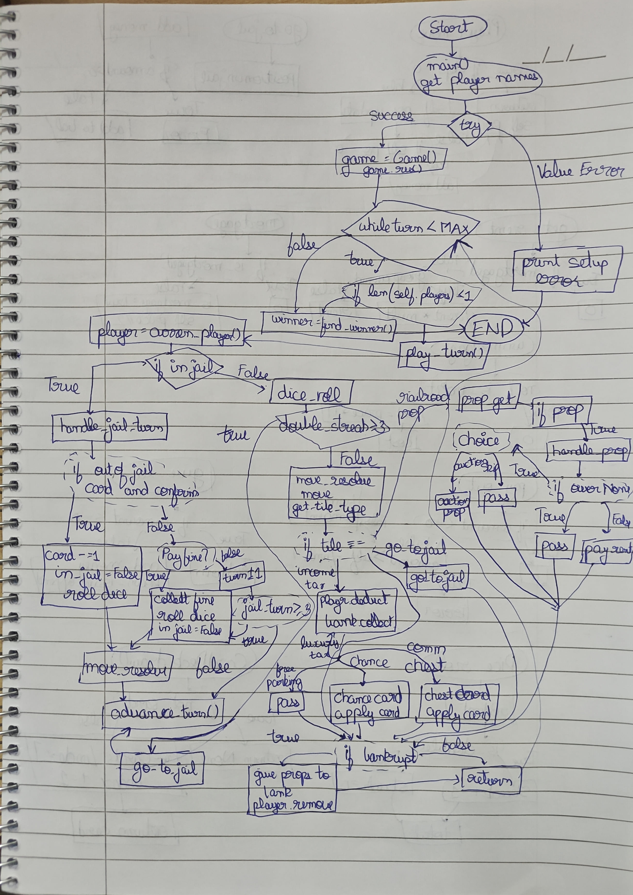
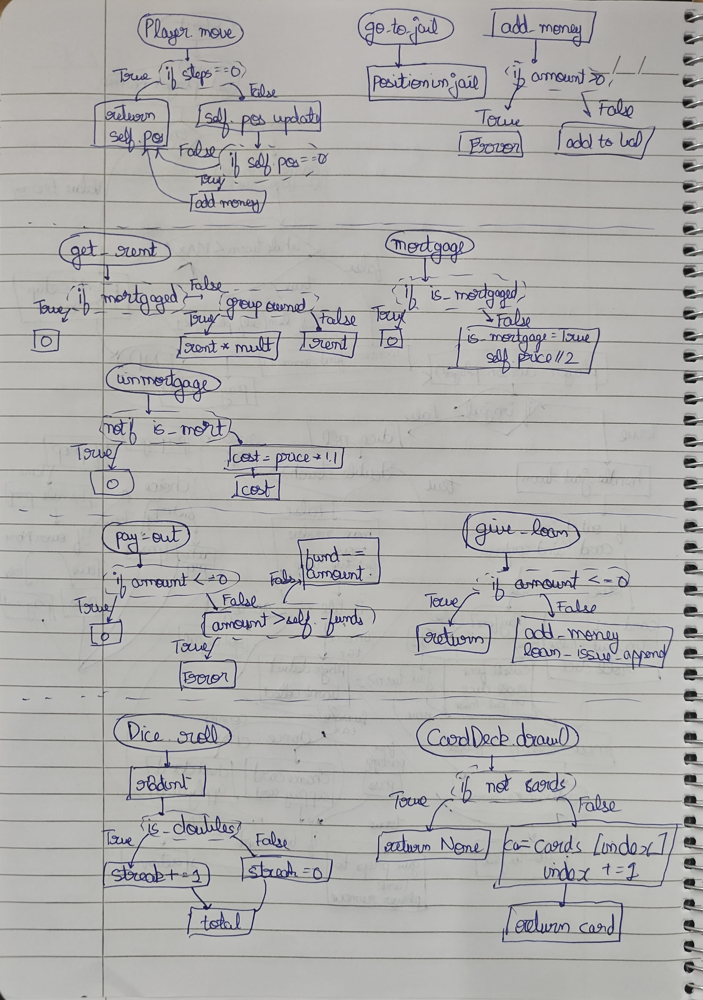

# Whitebox testing

## 1.1 Control flow graph

## 1.2 Code Quality analysis

**Iteration 1**
- Added docstrings to functions in main.py

**Iteration 2** (property.py)
- Addded module docstring
- Removed 2 attrs from Property class (both were unused)
- Removed argument from Property class
- Removed the else after return in Property.unmortage
- Added docstring to PropertyGroup

**Iteration 3** (cards.py)
- Formatted to have smaller length lines
- Added docstring

**Iteration 4** (boards.py)
- == True to just checking true
- Added docstring

**Iteration 5** (player.py)
- Remove import
- Add final newline
- Added docstring
- Remove unused var
- Removed is_elim attr

**Iteration 6** (game.py)
- Added docstring
- Made fstring to normal string
- Removed unused imports
- Removed unnecessary parens after not keyword
- Added final newline
- Removed setting player is eliminated
- Consolidated chance_deck and community_deck into a dictionary to reduce instance attributes
- Updated all references to use new decks dict structure
- Removed running attribute
- Extracted card action handling into separate private methods to reduce branching error

**Iteration 7** (config.py)
- Added module docstring for documentation

**Iteration 8** (player.py)
- Removed unused variable from move() method

**Iteration 9** (dice.py)
- Added module docstring
- Removed unused import of BOARD_SIZE
- Moved doubles_streak attribute initialization into __init__

**Iteration 10** (bank.py)
- Added module docstring
- Added Bank class docstring for clarity
- Removed unused math import

**Iteration 11** (ui.py)
- Added module docstring
- Specified exception type (ValueError)

# 1.3 White Box Test Cases

## Bugs

1. PropertyGroup.all_owned_by() Uses `any()` Instead of `all()`: The method uses `any()` which returns True if **any** property in the group is owned by the player, instead of checking if **all** properties are owned by the player.

2. Bank.collect() Docstring Doesn't Match Implementation: The docstring claims negative amounts are "silently ignored," but the code actually subtracts them from the bank's funds and records them in totals.

3. When giving move() function 0 steps, it wasn't checking the steps

4. Winner selection should use max networth.

5. Allow property purchase with exact balance, just not less than that

6. Award Go salary when passing the Go area not just when landing on it

7. Give rent payments to the property owner after deducting it from the spot lander

8. Deduct balance when paying the jail fine

9. After property selling transfer money to the property seller

10. Changed dice range to 6

11. Calculate networth using property and balance

## Test Case Details and Explanations

### Player Tests

- Tests moving within board bounds and verifies position updates correctly
- Tests landing exactly on position 0 and verifies GO salary ($200) is collected
- Tests moving from position 38 by 5 (wraps to position 3)
- Buy property checks if property is added to list
- Go to Jail function works or not
- Try to remove non existent property, it should throw an error
- Test if transactions are working correctly

### Property Tests

- Tests when player owns all properties in group and verifies rent doubling condition works
- Tests when player owns only some properties (1 of 2)
- Test mortgage value is half of price
- is_mortgaged state works properly
- Rent function for owned/unowned/mortgaged property works correctly

### Bank Fund Management Tests

- Tests normal fund collection
- Tests negative amount collection
- Tax collection, fund payouts, loans all work correctly
- Test normal loan amount, negative amount as well
- Test if paying funds are respected by the amount in bank

### Property group tests
- Validates the grouping of properties by color and tracks how many properties in a specific group are owned by each player.
- Specifically tests the logic for determining if a single player owns every property in a color group.

### TestCardDeck
- Ensures that drawing cards follows the established order and that the deck "wraps around" back to the first card once the last card is drawn.
- Tests "peeking" at the top card without removing it and counting remaining cards in the deck.

### TestGame & TestGameIntegration
- Verifies the game cycles through players in the correct order.
- Tests property purchases and trades between players, ensuring funds and ownership are transferred only if the buyer has sufficient cash.
- Confirms that drawing cards triggers the correct game effects, such as collecting money, paying fees, or going to jail.
- Validates that when a player goes bankrupt, they are removed from the game and their properties are returned to the bank (owner set to None).
- Tests integration scenarios, such as being sent to jail immediately after rolling three consecutive doubles.

### TestBoard
- Confirms that specific positions on the board correspond to the correct tile types (e.g., Position 0 is "Go", Position 10 is "Jail").
- Verifies that the board can return the correct Property object based on a numerical position index.
